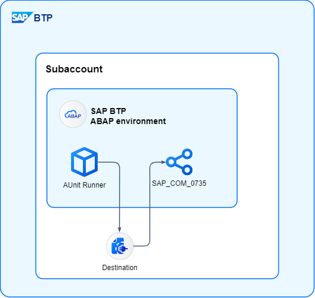

# AUnit Runner for ABAP Environment

## Introduction

On-premise, there is the RS_AUCV_RUNNER program for automating ABAP unit tests in order to regularly run the tests in packages. This program is also available in the ABAP environment, but due to the lack of access to the SAP GUI, it cannot be executed or scheduled.

The project provides the runner as an application job, which you can use to schedule it again. We use the standard API SAP_COM_0735 from SAP to start test runs in the system and receive the results.

## Setup

For installation in the system, the service must be made available, which the software then consumes.

- Configure the Communication Scenario SAP_COM_0735 as Inbound in your Development System
- Create with the User/Password a Destination and/or Communication Arrangement
- Install the components from this repository

## Material

Here you will find some material to get started with the project and learn some initial background information.

- [Software Heroes - ABAP Unit Runner](https://software-heroes.com/en/blog/btp-abap-unit-runner-en)
- [SAP Community - ABAP Unit Runner](https://community.sap.com/t5/technology-blogs-by-members/abap-environment-abap-unit-runner/ba-p/14009704)
- SAP Community - ABAP Unit Runner (Setup)
- SAP Community - ABAP Unit Runner (Analysis)
- SAP Community - ABAP Unit Runner (Behind the Scenes)
